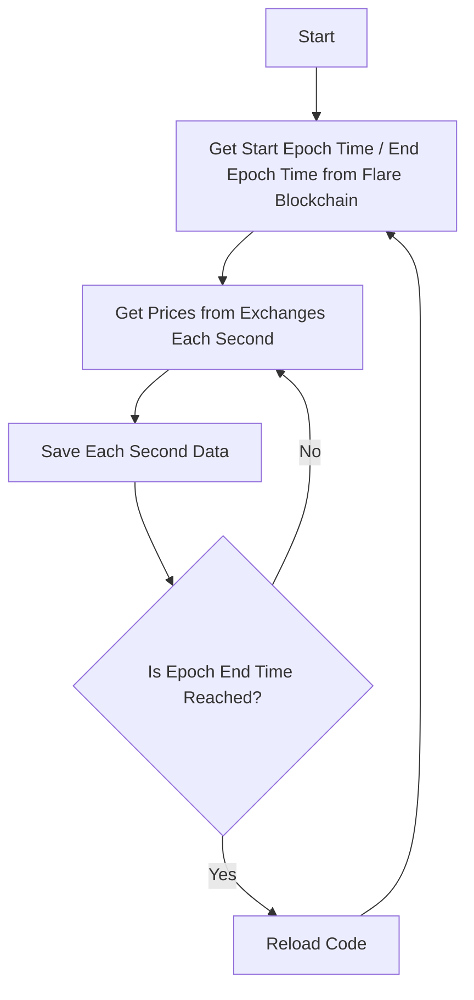

# Data Collection Process

This process involves collecting price data from various exchanges at each second, saving the data, and restarting the process at the end of each epoch. Below is a step-by-step explanation and a visual flowchart of the process.

### Steps

1. **Get Start Epoch Time / End Epoch Time from Flare Blockchain:**
   - Retrieve the current epoch's start and end times from the Flare blockchain.

2. **Get Prices from Exchanges Each Second:**
   - Query various exchanges every second to get the latest prices.

3. **Save Each Second Data:**
   - Store the collected data in the format: `{epochId, collectionTime, exchange, price, unit}`.

4. **Check Epoch End Time:**
   - If the epoch end time is reached, reload the code and go back to step 1.

### Process Flow Diagram

